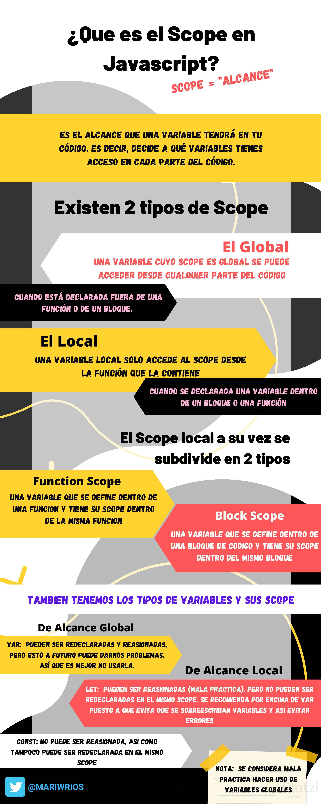
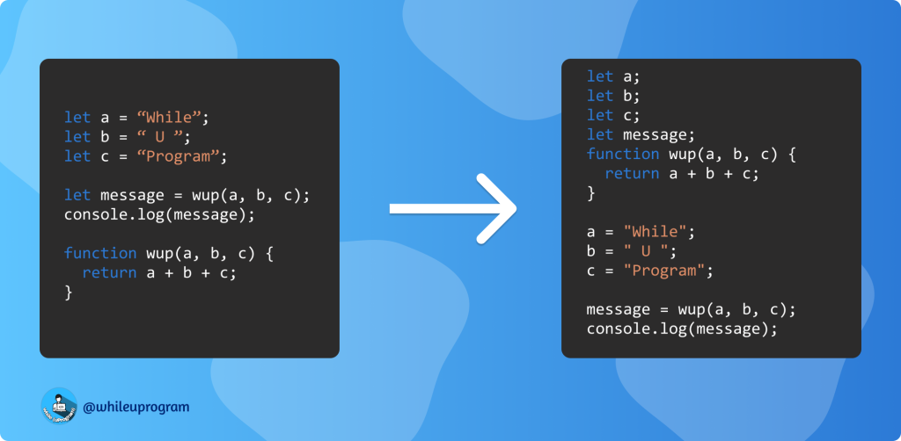

# Curso de Clousure y Scope en JavaScript
# Video 2 - Qué es el Scope y cómo funciona el Global Scope

 `Scope`: Es el alcance que va a tener una variable dentro del código. En otras palabras, el Scope se encargará de decidir a que bloques de código va a acceder una variable.

`Global Scope`: No están dentro de funciones o bloques, por lo tanto se puede acceder a ellas de manera global.
+ Con `var` podemos re-asignar una variable pero es una mala práctica.
+ Con `let` y `const` no podemos, aparecerá un error.
+ Es una mala práctica crear una variable sin las palabras reservadas: `var, let y const`.
+ Si se asigna una variable dentro de una función sin las palabras reservadas será una variable global.
+ La doble asignación de una variable también es una mala práctica.

# Video 3 - Local Scope

`Lexical Scope / Ámbito Léxico`: El intérprete de JavaScript funciona desde el ámbito de ejecución actual y funciona hasta encontrar la variable en cuestión. Si la variable no se encuentra en ningún ámbito, se genera una excepción.
Este tipo de búsqueda se llama ámbito léxico. El alcance de una variable se define por su ubicación dentro del código fuente, y las funciones anidadas tienen acceso a las variables declaradas en su alcance externo. No importa de dónde se llame una función, o incluso cómo se llama, su alcance léxico depende solo de dónde se declaró la función.
+ El `Local Scope`: se refiere a la variable o función que esta dentro de un bloque o funcion específica. Solo se pueden acceder a ellas (ejecutar o llamar) dentro del entorno en donde conviven.
+ El ámbito léxico: se refiere a que una función puede acceder a una funcion o variable fuera de ella. Cada nivel interno puede acceder a sus niveles externos hasta poder alcanzarlas.
+ `Ámbito léxico`: En que entorno se encuentra una pieza de código colocada.
+ `Contexto de ejecución`: El contexto donde se ejecuta el código.

# Video 4 - Function Scope

Un pequeño resumen sobre como actúan las diferentes variables:

+ Las variables escritas con la palabra clave `var` pueden ser redeclaradas, pero esto a futuro puede darnos problemas, así que es mejor no usarla
```
     var hola = "hola";
     var hola = "hola";  
```
+ Las variables escritas con la palabra clave `let` no pueden ser redeclaradas, si lo haces mostrara un “error: esta variable ya ha sido declarada” , pero su valor puede ser reasignado:
```
    let hola = "hola";
    hola = "Hi";
```  
+ Las variables escritas con la palabra clave const no pueden ser redeclaradas o reasignadas, ya que const quiere decir que su valor será constante, es decir que no va a cambiar.

# Video 5 -  Block Scope




# Video 6 - ¿Qué es un closure?

Para crear una CLAUSURA (Closure) EN JAVASCRIPT necesitamos 3 ingredientes: 
+ una función anidada, 
+ una referencia a una variable de un scope superior y 
+ una invocación a esta función pero desde otro scope distinto al que fue creada.

```
    const moneyBox = () => {
        var saveCoins = 0;
        const countCoins = (coins) => {
            saveCoins += coins;
            console.log(saveCoins);
        }
        return countCoins;
    }

    let myMoneyBox = moneyBox()
    myMoneyBox(4)
    myMoneyBox(10)
    myMoneyBox(6)
```

Un closure es la combinación entre una función y el ámbito léxico en el que esta fue declarada. Con esto, la función recuerda el ámbito en el que se creó. La mejor forma de entender un closure es por medio de un ejemplo práctico. 


## Ejemplo de closure.

Cuando declaramos una función dentro de nuestro global scope, estamos usando un closure.

```
    var myVar = 'hi';
    function myFunction() {
	    console.log(myVar);
    }
    myFuntion(); // hi
```

Los closures son basicamente cuando aprovechamos la habilidad de Javascript de usar las variables que están en el scope padre de nuestro bloque de código, por eso el global scope es un closure grandote; el bloque myFunction puede usar TODAS las variables que están disponibles en el bloque inmediato anterior.

## Usando el ejemplo del profesor:
Si tu declaras la variable saveCoins en el global scope, estarías usando el mismo principio que si usas la segunda función que escribe el profesor porque estás usando las variables que están en el scope padre.

```
    var saveCoins = 0;

    const moneyBox = (coins) => {
        saveCoins += coins;
        console.log(saveCoins);
    }

    moneyBox(5); //5
    moneyBox(10); //15

```

Pero está mal visto modificar variables globales, por eso es que quieres crear variables dentro de un scope cerrado y que interactuen entre ellas, entonces declaras las variables que vas a usar dentro del scope padre del bloque que las va a modificar para que siempre pueda acceder a ellas. Para eso creas un nuevo “global scope” ficticio que va a conservar todas las variables que tú quieras monitorear:
Ahora mira las similitudes entre el codigo de arriba y el que está justo abajo de aquí…

```
    const moneyBox = () => {
        var saveCoins = 0;
        const countCoins = (coins) => {
            saveCoins += coins;
            console.log(saveCoins);
        }
        return countCoins;
    }

    let myMoneyBox = moneyBox()
    myMoneyBox(4)
    myMoneyBox(10)
    myMoneyBox(6)
```

Si remueves " const moneyBox = () => {} " serían exactamente las mismas lineas de código!

```
//const moneyBox = () => {
    var saveCoins = 0;
    const countCoins = (coins) => {
        saveCoins += coins;
        console.log(saveCoins);
    }
   // return countCoins; 
//}

```

# Video 7 - Ámbito léxico en closures

+ El ambito lexico: 
    + Se refiere a que una funcion puede acceder a una funcion o variable fuera de ella. Cada nivel interno puede acceder a sus niveles externos hasta poder alcanzarlas.
    + En que entorno se encuentra una pieza de código colocada.

# Video 8 - Cómo crear variables privadas con closures

Variables privadas con Closures: JS por su naturaleza no fomenta el uso de datos privados pero por medio de los Closures podemos crear valores que solo puedan ser accedidos por medio de métodos, que no van a estar disponibles fuera de esta función.

```
const person = () =>{
    var saveName = "Name"
    return {
        getName: () =>{
            return saveName;
        },
        
        setName: (name) => {
            saveName = name;
        }
    }
}

newPerson = person();
console.log(newPerson.getName());
newPerson.setName('Oscar');
console.log(newPerson.getName());
```

# Video 9 - Loops

🔦En un loop nunca ocupes `var`, siempre utiliza `let` para valores que irán cambiando dentro de la ejecución del scope.

# Video 10 - ¿Qué es el hoisting?

HOISTING en inglés significa ELEVACIÓN, y cuando pienso en HOISTING a mí me gusta pensar en un GLOBO DE HELIO que se eleva.



# Video 11 - Debugging
